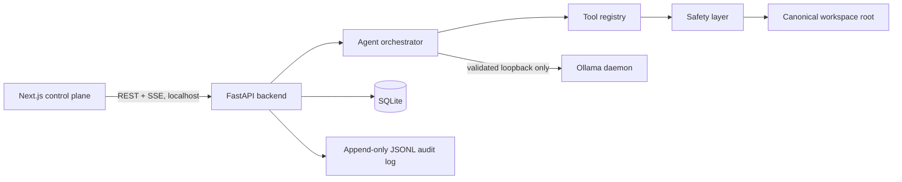

# Local Ollama Agent Harness

This repository implements a **local-only, approval-gated coding and file agent**. The FastAPI runtime is restricted to one configured workspace and communicates with an Ollama daemon only at a validated loopback address. The companion Next.js/Tailwind-style control plane provides a streaming chat transcript, proposed diffs, approvals, workspace browser, audit records, model selection, rate status, session resume, and a server-side kill switch.

> **Safety posture:** restrictive by default. An unavailable capability produces a clear denial rather than a permissive fallback. Command execution requires the supplied Linux `unshare` namespace adapter; argv allowlisting alone does not constitute a process sandbox.

## Architecture



The backend has a single HTTP client, `OllamaClient`. Its base URL is validated during startup: `OLLAMA_HOST` must resolve entirely to a loopback IP address unless an operator deliberately sets `ALLOW_REMOTE_OLLAMA=true`. HTTP clients are constructed with `trust_env=False`, preventing proxy environment variables from routing Ollama traffic externally. The frontend uses only the configured local backend URL.

## Non-negotiable controls

| Area | Implementation | Default behavior |
| --- | --- | --- |
| Workspace sandbox | `os.path` canonicalization after symlink resolution, descendant test with `Path.relative_to`, Windows-path/null-byte/traversal rejection | Only `WORKSPACE_ROOT` can be addressed; secret-shaped paths such as `.env` and `.git/config` are blocked. |
| File mutation | Diff/plan is generated before action | New sessions are dry-run. A live mutation must produce a durable approval record unless a user explicitly remembers that action type for that session. |
| Command execution | argv-only validation; binary allowlist; metacharacter rejection; scrubbed environment; timeout/process-group kill; user/mount/network/PID namespaces | Runs only in the supplied `unshare` adapter; fails closed if Linux namespaces are unavailable. |
| Git | Explicit local operations only | No push, fetch, pull, remote, reset, clean, rebase, force checkout, or branch deletion path exists. |
| Agent limits | `RunBudget` maintained server-side | Max iterations, wall-clock time, per-turn output tokens, total session tokens, and file read/write sizes terminate cleanly. |
| Ollama health and load | Shared token bucket, generation semaphore, cooldown state machine | Rate limiting protects CPU/GPU health, provides cross-session backpressure, and stops runaway loops. It is **not** cloud-billing protection. |
| Audit | Redacted JSONL + SQLite mirror | Every agent/user action captures outcome, dry-run state, approval source, target, and content hashes. |

## Local setup

### Prerequisites

Install [Ollama](https://ollama.com/) locally, pull at least one local model, and make sure its daemon is listening on the loopback default `127.0.0.1:11434`.

```bash
ollama serve
# in another terminal; choose a model available for your hardware
ollama pull llama3.1:8b
```

### Backend

```bash
cd backend
cp .env.example .env
# Edit WORKSPACE_ROOT to a dedicated, non-sensitive project directory.
# Never set it to /, a home directory, or a directory with credentials.
python3 -m pip install -e '.[dev]'
uvicorn app.main:app --host 127.0.0.1 --port 8000
```

The included development `.env` points to `../workspace`, a deliberately empty dedicated root. It is ignored by Git. The server refuses to boot if the workspace is missing, too broad, or the Ollama host violates loopback policy.

### Frontend

```bash
cd frontend
cp .env.local.example .env.local
npm install
npm run dev
# Open http://localhost:3000
```

Keep the backend on `127.0.0.1:8000` and the frontend on `localhost:3000` unless corresponding origins are changed deliberately in `.env`. The API CORS policy is locked to `FRONTEND_ORIGIN`; it is not a wildcard.

## User workflow

1. Select a model discovered live from `GET /api/tags`, then create or resume a session.
2. Start in the persistent **Dry run ON** state. Reads and keyword search execute, while proposed writes/deletes/commands/commits/checkouts return a visual plan or unified diff.
3. Toggle Dry run off only when ready; that user action is auditable. Sensitive action types pause as an SQLite-backed pending approval.
4. Review the plan, then **Approve once**, **Deny**, or **Approve & remember for this session**. A denial returns tool data telling the model not to repeat the same request.
5. Use **Stop run** at any time. It flips the server-side run budget cancellation flag rather than merely closing the browser stream.
6. Inspect the read-only file browser and independent audit trail. Applied overwrite/delete operations create a pre-change snapshot in `.harness-snapshots` for a one-click-revert integration point.

## Model behavior

On startup/run, the backend checks Ollama health. It also exposes `GET /api/models/{model}/capabilities`, backed by `/api/show`. Models advertising native `tools` receive Ollama function schemas. Other models receive a strict one-JSON-object ReAct contract. Malformed JSON is rejected and a corrective response consumes an iteration; it cannot bypass the server-side limits.

Tool results and file contents are passed as tool/data messages, never interpolated into the system instruction. This maintains the prompt-injection boundary: a file that says “ignore the safety rules” is content to analyze, not a directive.

## Command execution and OS isolation

The repository intentionally distinguishes **allowlisting** from **sandboxing**. Commands never use a shell; metacharacters are rejected; the environment is minimal; and the working directory is the workspace. That still is not proof that a general binary cannot access host files.

Accordingly, `EXEC_REQUIRE_OS_SANDBOX=true` requires the built-in Linux `unshare` adapter. For each approved, non-dry-run execution it creates a user, mount, network, and PID namespace, makes mounts private, mounts only the configured workspace plus read-only `/usr` runtime binaries/libraries into a fresh temporary root, `chroot`s there, and starts with an empty environment. The network namespace has no configured route. It uses argv all the way through; the fixed namespace setup program is not derived from model input. If `unshare` is unavailable, execution is denied. The process is still constrained by the allowlist, the explicit timeout, and a process-group kill on expiry.

## API surface

| Endpoint | Purpose |
| --- | --- |
| `GET /api/health`, `GET /api/models` | Local daemon health and live installed model discovery. |
| `POST /api/sessions`, `GET /api/sessions` | Create/resume SQLite-persisted sessions. |
| `POST /api/sessions/{id}/run` | SSE stream interleaving token, tool, approval, completion, and error events. |
| `POST /api/sessions/{id}/dry-run`, `POST /api/sessions/{id}/kill` | Logged protection change and server-side cancellation. |
| `GET /api/approvals`, `POST /api/approvals/{id}/resolve` | Cross-session approval queue and resolution. |
| `GET /api/files`, `GET /api/files/content` | Sandboxed read-only file browser. |
| `GET /api/audit`, `POST /api/index/refresh` | Auditable actions and capped local metadata index refresh. |

## Verification

The backend suite covers traversal, absolute paths, symlink escape, null bytes, Windows paths, credential paths, non-loopback Ollama rejection, command injection, path smuggling, remote/destructive Git denial, dry-run diffs, approval denial/remember scope, rate bucket/cooldown/concurrency, agent iteration/time/token/file limits, and the complete search → proposed edit → denied approval → preserved filesystem integration flow.

```bash
cd backend
pytest -q

cd ../frontend
npm run build
```

## Explicit v1 boundaries

There is no cloud-model fallback, network access beyond the validated Ollama daemon, multi-workspace/multi-tenant routing, live `.env` editing, auto-updating allowlists, Git remote operation, or semantic indexing enabled by default. Semantic search is reserved for a future local Ollama `/api/embeddings` implementation that obeys the same shared limiter and local-host validation.
